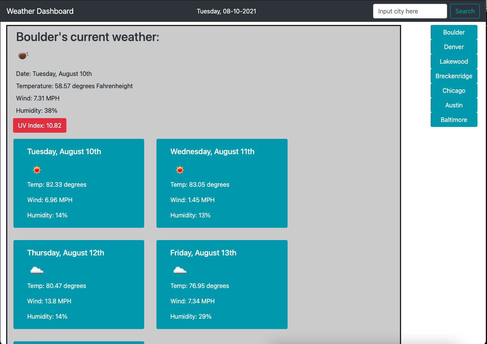

# WeatherDashboard-HaydenHaun

LIVE APPLICATION: https://hayden-haun.github.io/WeatherDashboard-HaydenHaun/

GITHUB REPOSITORY: https://github.com/Hayden-Haun/WeatherDashboard-HaydenHaun

ABOUT: This application allows a user to check the weather for a city of their choice. Weather data is pulled from a third party API called Open Weather https://openweathermap.org/

FEATURES:
*User city searches are saved in local storage for future user.
*When user clicks on a city, weather data for the current day is displayed with an image.
*The UV Index element will change color depending on the severity in that city.
*The application shows a 5 day forecast. Data presents the forecasted values at 6:00pm each day.

